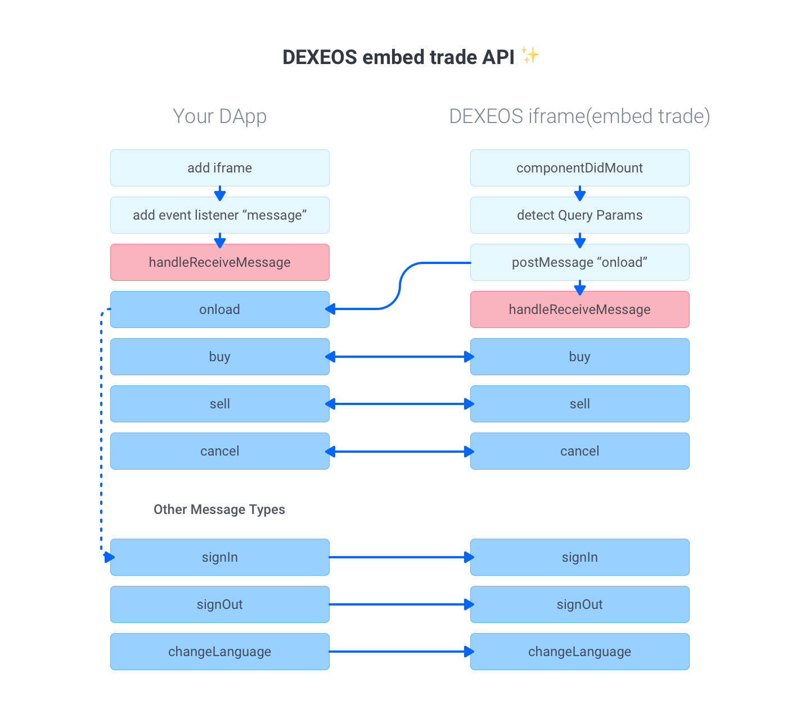

# DEXEOS embed trade API
✨ Enjoy DEXEOS Trade within your DApp!  
## Flow

## Lists
- [Getting started](#getting-started)
- [Example](#example)
- [Docs](#docs)
    - [embed trade URI](#embed-trade-uri)
        - [Token Symbol](#token-symbol)
        - [Language](#language)
    - [Message Types](#message-types)
        - Send
            - signIn
            - signOut
            - changeLanguage
        - Receive
            - onload
            - buy
            - sell
            - cancel
---
## Getting started
1. Add iframe tag with your app 
    ```
    // Input token symbol ex) BLACK, DICE, JKR... etc
    // You can get a token list to this links ==>  https://api.dexeos.io/v2/token or https://dexeos.io/trade  
    <iframe title="DEXEOS Trade" src="https://dexeos.io/embed/:symbol"></iframe>
    ```
2. Add event listener
    ```
    window.addEventListener("message", this.handleReceiveMessage, false);
    ```
3. then now you customize "handleReceiveMessage" and "handleTransaction" function, here is a example
    ```
   handleReceiveMessage = e => {
       if (e.data.indexOf("setImmediate") > -1) return;
       const receiveMessage = JSON.parse(e.data);
       const { msgId } = receiveMessage;
   
       const { key, transaction } = receiveMessage.data;
   
       switch (msgId) {
         case "onload":
           // Input Account Name here
           const options = { accountId: "dexeoswallet" };
           const message = { msgId: "signIn", data: options };
           e.source.postMessage(JSON.stringify(message), e.origin);
           break;
         case "buy":
           return this.handleTransaction(e, msgId, key, transaction);
         case "sell":
           return this.handleTransaction(e, msgId, key, transaction);
         case "cancel":
           return this.handleTransaction(e, msgId, key, transaction);
         default:
       }
    };
    
   handleTransaction = (e, msgId, key, transaction) => {
        // Call eos transaction action in here
        eos
          .transaction(transaction)
          .then(result => this.handleTransactionSuccess(e, msgId, key, result))
          .catch(error => this.handleTransactionFailed(e, msgId, key, error));
   };
    
    handleTransactionSuccess = (e, msgId, key, result) => {
        console.log("EOS Transaction Success ========>", result);
        const data = { key, result };
        const message = { msgId, data };
        e.source.postMessage(JSON.stringify(message), e.origin);
    };
    
    handleTransactionFailed = (e, msgId, key, error) => {
        console.log("EOS Transaction Error ========>", error);
        const data = { key, error };
        const message = { msgId, data };
        e.source.postMessage(JSON.stringify(message), e.origin);
    };
    ```
4. 🍺 That's all :D

## Example
- [React.js](example/react/index.jsx)
## Docs
### embed trade URI
current: `https://dexeos.io/embed/:symbol`  
#### Token Symbol
Get Token List: `https://api.dexeos.io/v2/token` or `https://dexeos.io/trade`  
ex) `BLACK, DICE, JKR... etc`  
#### Language
params: `lang`  
types: `en`, `ko`, `zh-CN`, `zh-TW`  
default: `en`  
ex) `https://dexeos.io/embed/BLACK?lang=ko`
### Message Types
#### Send
##### signIn
##### signOut
##### changeLanguage
